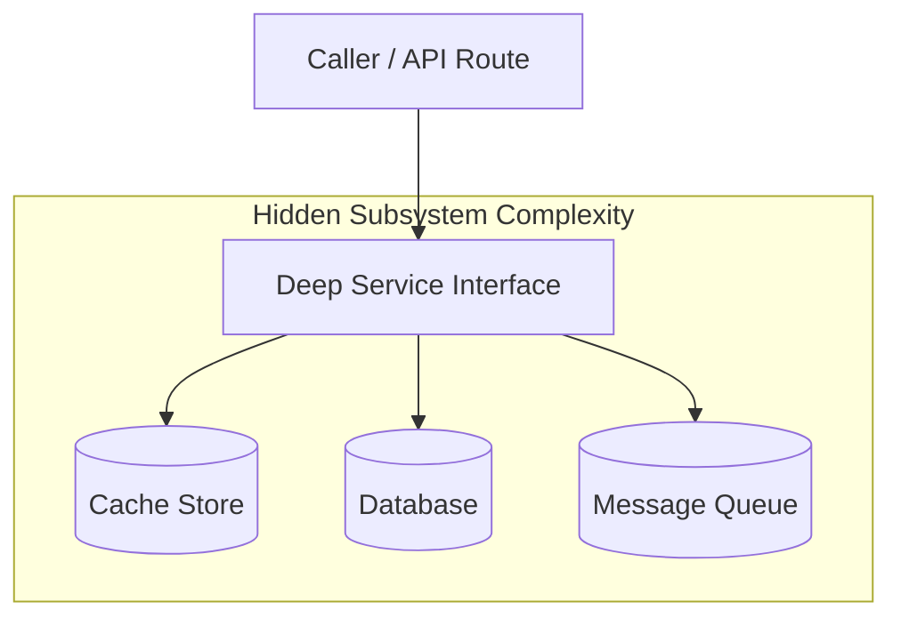

# Codebase health, churn hotspots, and deletion tests

Techniques to discover architectural debt, identify churn hotspots, and prove whether candidate abstractions carry genuine depth.

## 1. Git churn hotspot detection

Code that changes frequently alongside repeated bug fixes signals leaky abstractions or tight coupling.

1. **Rank files by commit churn.** Identify the most frequently edited files across recent history:
   ```bash
   git log --name-only --format='' --since="6 months ago" | grep -v '^$' | sort | uniq -c | sort -nr | head -20
   ```
2. **Correlate churn with complexity.** Compare top churn files against file line counts and cyclomatic complexity. A large file with frequent modifications indicates mixed responsibilities that require extraction into deep modules.
3. **Trace co-change coupling.** Identify files that always commit together in identical git commits:
   ```bash
   git log --name-only --format='COMMIT' | awk '/COMMIT/{if (f) print f; f=""; next} {f=f $0 " "} END{print f}'
   ```
   If editing a service consistently requires editing an unrelated controller or helper, the boundary has leaked.

## 2. The deletion test for shallow abstractions

Validate whether an existing wrapper justifies its cognitive overhead:

1. **Simulate removal.** Delete or bypass the candidate module temporarily.
2. **Evaluate caller impact.** Check caller behavior:
   - If callers merely change `wrapper.execute()` to `innerService.execute()` with no other adjustments, the module is a shallow pass-through and should be deleted.
   - If removing the module forces callers to manage multi-step coordination, synchronization locks, error recovery branches, or state caching, the module is deep and load-bearing.
3. **Refactor shallow layers.** Collapse pass-through wrappers directly into the underlying service or callers to reduce indirection.

## 3. Visualizing architecture seams with Mermaid

When proposing architectural restructuring, visualize boundaries with clean Mermaid diagrams:



Ensure internal dependencies remain hidden behind the single interface boundary.
