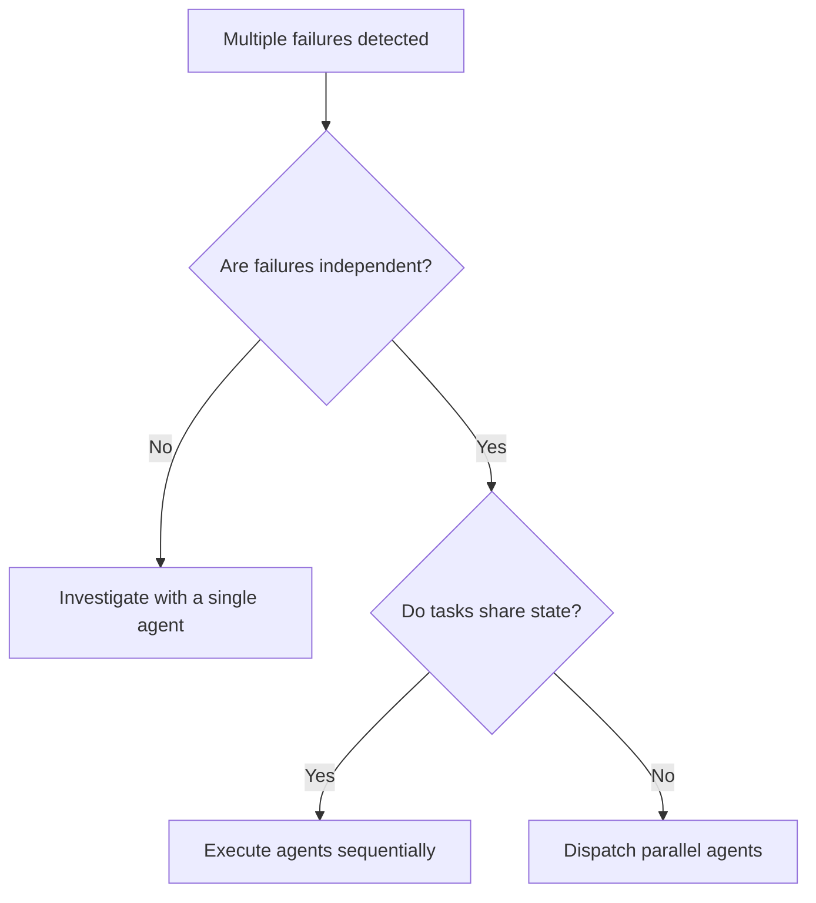

# Dispatching parallel agents

Delegate independent tasks to concurrent subagents with isolated context.

## Overview

Investigating multiple unrelated failures sequentially wastes execution time. Independent problems, such as different test files or isolated subsystems, do not require shared context.

Dispatch one agent per independent problem domain. Provide each agent with isolated context containing only the instructions, errors, and files needed for its specific task. Keep coordinator context lean for reviewing and integrating changes.

## When to use



Dispatch parallel agents under these conditions:
- Three or more test files fail with distinct root causes.
- Multiple subsystems fail independently.
- An investigator can understand each defect without inspecting other subsystems.
- Tasks share no disk state, database records, or shared mock state.

Do not dispatch parallel agents under these conditions:
- Failures share a root cause where one fix resolves multiple errors.
- Understanding the defect requires inspecting whole system state.
- Tasks require exploratory debugging before identifying what broke.
- Agents edit the same target files or compete for the same execution resources.

## Workflow

Follow these four steps in sequence:

### Step 1. Partition independent problem domains

Inspect failing tests or task requirements. Group failures by subsystem, test file, or defect domain. Confirm zero file overlap between agent targets.

Completion criterion. A written list of independent problem domains with disjoint target files.

### Step 2. Construct isolated task prompts

Draft a distinct prompt for each agent. Include three components in every prompt:
1. Target scope. Name the exact test files, source files, and failure messages.
2. Directives and boundaries. State reproduction commands, permitted changes, and prohibitions against editing files outside the target domain.
3. Return requirements. Specify the required return format, requesting root cause analysis, modified files, and verification output.

Completion criterion. One self-contained prompt per domain containing exact paths, error traces, and scope boundaries.

### Step 3. Dispatch parallel agents

Launch subagents concurrently using background tasks or subagent dispatch tools. Allow agents to execute simultaneously without active polling loops.

Completion criterion. All subagents running concurrently in isolated contexts.

### Step 4. Review and integrate changes

Inspect incoming reports as agents complete their tasks. Follow this review sequence:
1. Read the root cause analysis and verified changes from each agent.
2. Check file diffs across all branches or agent workspaces to ensure no overlapping file modifications occurred.
3. Run the full regression test suite across the combined modifications.
4. Verify that no agent introduced regressions or masked failures by increasing timeouts.

Completion criterion. Zero conflicting edits across subagent outputs and a passing test suite across all modified domains.

## Prompt structure

Use this template when constructing prompts for parallel subagents:

```markdown
Fix the 3 failing tests in src/agents/agent-tool-abort.test.ts:

1. "should abort tool with partial output capture", expects 'interrupted at' in message
2. "should handle mixed completed and aborted tools", fast tool aborted instead of completed
3. "should properly track pendingToolCount", expects 3 results but gets 0

These failures indicate timing or race condition issues. Follow these steps:

1. Read the test file and identify what each test verifies.
2. Identify the root cause, distinguishing timing bugs from functional defects.
3. Resolve the failure:
   - Replace arbitrary timeouts with event-based waiting.
   - Fix abort logic in the source implementation if broken.
   - Adjust test expectations only if intentional behavior changed.

Do not increase timeout durations. Fix the underlying defect.
Do not edit files outside src/agents/agent-tool-abort.test.ts and its direct implementation.

Return format:
- Root cause diagnosis
- Modified files and diff summary
- Test execution output confirming green status
```

## Anti-patterns and corrections

Review these failure modes before dispatching agents:

| Anti-pattern | Failure mechanism | Corrective action |
|---|---|---|
| Broad scope assignment | The agent attempts to inspect multiple subsystems and loses focus | Assign exactly one test file or subsystem per agent |
| Missing error context | The agent wastes cycles searching for the failure location | Provide exact error messages, stack traces, and test identifiers |
| Unbounded file permissions | The agent refactors shared utilities and breaks adjacent systems | Prohibit modifications outside the assigned target files |
| Vague completion format | The agent reports completion without evidence | Require root cause diagnosis, file diffs, and verification commands |
| Shared resource collision | Agents mutate the same database table or mock server simultaneously | Isolate environments or sequence dependent tasks |
