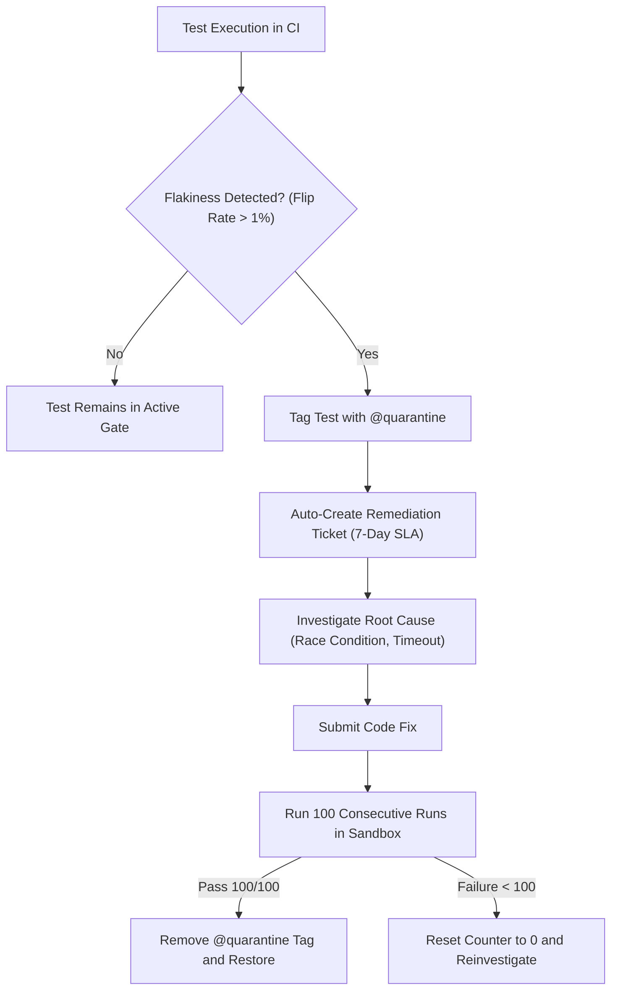

# Quality gate checklist, flaky test quarantine, and performance budgets

Automated pipeline thresholds, flaky test governance protocols, differential mutation targets, and shift-left security verification standards.

## 1. Pipeline quality gate standards

Continuous delivery pipelines enforce deterministic quality boundaries through a two-tier execution model. Each tier balances developer feedback latency against depth of verification.

### Tier 1 fast pull request gate (Execution budget under 8 minutes)

Tier 1 executes on every pull request commit, providing rapid feedback to developers:

* Strategy. Fast-fail matrix execution (`fail-fast: true`). The first failing job terminates remaining parallel jobs to preserve compute resources and deliver immediate failure signals.
* Static Verification. Linters (ESLint, Biome), code formatters (Prettier), and static type checkers (`tsc --noEmit`, `mypy`) verify code structure.
* Secret Detection. Scanners (Gitleaks) audit pull request git diffs for committed API keys, private certificates, or database credentials.
* Test Impact Analysis. Test runners (Vitest, Jest) use git change tracking to execute only the unit tests covering modified source files and their immediate dependencies.
* Caching Architecture. Runners mount dependency caches (npm, pnpm, pip, Gradle) and remote Docker layer caches to avoid redundant compilation.

### Tier 2 merge queue gate (Execution budget under 30 minutes)

Tier 2 executes before integrating code into the mainline branch:

* Strategy. Complete run model (`fail-fast: false`). Mainline qualification requires an exhaustive inventory of all regressions across every supported platform.
* Containerized Integration Suites. Integration tests execute against real production-grade services (PostgreSQL, Redis, Kafka) using Testcontainers mounted on in-memory filesystems (`tmpfs`).
* Contract Verification. Consumer-driven contract tests via Pact verify inter-service schema compatibility without spinning up external microservices.
* End-to-End User Journeys. Playwright runs automated tests covering Tier 1 critical paths (authentication, checkout, core data mutation) across headless browser engines.
* Differential Mutation Testing. Stryker or Pitest executes mutation analysis on modified lines to ensure test assertions detect simulated bugs.

## 2. Flaky test quarantine protocol

Flaky tests exhibit non-deterministic pass and fail outcomes when executed against identical code commits. They erode developer confidence, trigger redundant CI runs, and hide genuine regressions.



### Automated detection via flip rate heuristics

Flakiness is quantified mathematically using flip rate tracking:

1. Flip Rate Definition. A flip occurs whenever a test changes its outcome from pass to fail or from fail to pass across consecutive runs on the same commit or mainline branch.
2. Calculation Formula. The flip rate equals the number of status transitions divided by the total number of test executions over a rolling window of 50 runs or 14 calendar days:
   ```
   FlipRate = StatusTransitions / TotalExecutions
   ```
3. Quarantine Threshold. Any test exhibiting a flip rate exceeding one percent (more than one flip per 100 runs) triggers automated quarantine.

### Immediate isolation protocol

Upon triggering the flakiness threshold, the test is isolated immediately:

1. Programmatic Isolation. Annotate the test definition with the `@quarantine` tag or add the test identifier to the quarantine configuration file:
   ```typescript
   // Example quarantine annotation in Playwright
   test('user can complete checkout via express button', { tag: '@quarantine' }, async ({ page }) => {
     // Test body preserved without modification
   });
   ```
2. Non-Blocking CI Execution. Quarantined tests execute in a separate, non-blocking pipeline job. Their failures emit telemetry warnings but do not block pull request merges.
3. Assertion Preservation. Modifying assertions or commenting out flaky test code in place is strictly prohibited. The test body remains intact while awaiting remediation.
4. Automatic Issue Creation. The CI system generates an issue ticket assigned to the owning team containing failure logs, environment seeds, and run history.

### Seven-day remediation service level agreement

Every quarantined test enters an enforced remediation lifecycle:

* Days 1 to 2. Root cause investigation. Engineers analyze trace logs, identify asynchronous race conditions, locate hardcoded sleeps, or isolate shared database state.
* Days 3 to 5. Implementation of fix. Developers replace arbitrary timeouts with auto-waiting assertions, isolate database fixtures via transactions, or mock unstable third-party networks.
* Days 6 to 7. Peer review and verification. The fix undergoes team review and enters the rehabilitation pipeline.
* Escalation and Archival. If a test remains quarantined after seven days, an escalation notification alerts engineering leads. Tests remaining in quarantine after fourteen days without active remediation are permanently removed from the test suite to prevent ghost maintenance.

### One-hundred-run rehabilitation protocol

A quarantined test must prove complete determinism before returning to the blocking gate:

1. Sandbox Execution. The candidate test executes in an isolated CI runner executing 100 consecutive iterations.
2. Stress Conditions. The 100 runs execute across randomized concurrency settings, randomized database seed sequences, and varied network latency conditions.
3. Zero Failure Tolerance. If any single run out of the 100 executions fails, the counter immediately resets to zero and the test remains quarantined.
4. Restoration. Upon completing 100 consecutive successful executions, the `@quarantine` tag is removed, restoring the test to the Tier 1 or Tier 2 blocking gate.

## 3. Differential mutation testing targets

Traditional code coverage measures executed lines, but fails to verify whether assertions actually validate system correctness. Mutation testing introduces synthetic defects (mutants) into source code to verify that test suites detect and fail on each defect.

### Differential mutation testing on pull requests

Running mutation testing across entire codebases consumes prohibitive compute time. Differential mutation testing evaluates only the code lines modified in the pull request:

```bash
# Stryker Mutator differential execution for TypeScript
npx stryker run --since origin/main --concurrency 4
```

### Mutation operators and mechanics

Mutators apply systematic AST modifications to evaluate assertion depth:

* Arithmetic Operator Replacement. Replaces `+` with `-`, or `*` with `/`.
* Equality and Relational Boundary Mutators. Replaces `<` with `<=`, or `===` with `!==`.
* Logical Inversion Mutators. Replaces `&&` with `||`, or `true` with `false`.
* Statement Removal Mutators. Strips void function calls or error throwing statements.

### Metric threshold and survivor analysis

* Mutation Score Metric. The mutation score is calculated as killed mutants divided by total mutants multiplied by 100:
   ```
   MutationScore = (KilledMutants / TotalMutants) * 100
   ```
* Mandatory Quality Gate. Pull requests must achieve a minimum mutation score of eighty percent on modified code lines.
* Survivor Triage. When a mutant survives, the engineer inspects the surviving mutation:
  * Missing Assertion. The test executed the line but did not verify the output. Remediate by adding explicit assertions.
  * Equivalent Mutant. The mutation modifies syntax without altering semantic behavior. Document the equivalence and configure mutator exclusions.

## 4. Performance budgets

System responsiveness and resource efficiency are verified in continuous integration using strict latency thresholds.

### Backend API latency budgets via k6

Backend services undergo automated load validation against established service level objectives:

* Latency Thresholds:
  * 95th percentile (p95) response latency under 200 milliseconds.
  * 99th percentile (p99) response latency under 500 milliseconds.
  * HTTP request failure rate under 0.1 percent.
* k6 Execution Script. The pipeline executes automated load tests exercising key user transactions:
  ```javascript
  import http from 'k6/http';
  import { check, sleep } from 'k6';

  export const options = {
    stages: [
      { duration: '1m', target: 20 },
      { duration: '3m', target: 50 },
      { duration: '1m', target: 0 },
    ],
    thresholds: {
      http_req_duration: ['p(95)<200', 'p(99)<500'],
      http_req_failed: ['rate<0.001'],
    },
  };

  export default function () {
    const res = http.get('http://api-service:8080/api/v1/catalog');
    check(res, { 'status is 200': (r) => r.status === 200 });
    sleep(0.5);
  }
  ```

### Frontend Core Web Vitals via Lighthouse CI

Client web applications must satisfy performance budgets verified using Lighthouse CI:

* Largest Contentful Paint (LCP). Must measure under 2.5 seconds. Evaluates perceived loading speed of the primary content block.
* Interaction to Next Paint (INP). Must measure under 200 milliseconds. Evaluates interface responsiveness to user clicks and taps.
* Cumulative Layout Shift (CLS). Must measure under 0.1. Evaluates visual stability and unexpected layout shifting.
* Lighthouse CI Configuration (`.lighthouserc.json`):
  ```json
  {
    "ci": {
      "collect": {
        "numberOfRuns": 3,
        "startServerCommand": "pnpm run start",
        "url": ["http://localhost:3000/"]
      },
      "assert": {
        "assertions": {
          "largest-contentful-paint": ["error", { "maxNumericValue": 2500 }],
          "interaction-to-next-paint": ["error", { "maxNumericValue": 200 }],
          "cumulative-layout-shift": ["error", { "maxNumericValue": 0.1 }],
          "categories:performance": ["error", { "minScore": 0.9 }]
        }
      }
    }
  }
  ```

## 5. Security and compliance checks

Automated security verification operates as a non-negotiable blocking gate:

### Shift-left secret detection (Gitleaks)

* Execution Hook. Runs in local pre-commit hooks via Husky and during Tier 1 pull request validation.
* Scan Scope. Analyzes commit history, staged file changes, and environment template files against detailed entropy rules.
* Gate Condition. Zero detected plaintext secrets, API keys, private certificates, or tokens. Any positive match aborts the pipeline immediately.

### Software composition analysis and container scanning (Trivy)

* Execution Scope. Scans application dependency manifests (`package-lock.json`, `pnpm-lock.yaml`, `pom.xml`) and built Docker images.
* Gate Condition. Zero Critical or High severity Common Vulnerabilities and Exposures (CVEs) with available vendor fixes allowed in production builds.
* Remediation Protocol. Identified vulnerabilities require dependency version upgrades or formal security exception documentation prior to merging.

### Dynamic application security testing (OWASP ZAP)

* Execution Target. Scans ephemeral pull request preview deployments or staging integration environments.
* Rule Coverage. Passive and active inspection for Cross-Site Scripting (XSS), missing security headers (Content-Security-Policy, Strict-Transport-Security, X-Content-Type-Options), insecure cookie attributes (missing HttpOnly or Secure flags), and Cross-Origin Resource Sharing (CORS) wildcards.
* Gate Condition. Pipeline halts on any reported High or Medium severity finding.

## 6. Master quality gate checklist

The matrix below summarizes all pipeline gating requirements:

| Stage | Verification Area | Tooling | Threshold Budget | Gating Mode | Failure Remediation Path |
| --- | --- | --- | --- | --- | --- |
| Tier 1 | Static Linting | ESLint, Biome | 0 errors, 0 warnings | Blocking | Fix code syntax and formatting |
| Tier 1 | Type Safety | TypeScript, MyPy | 0 compilation errors | Blocking | Resolve type discrepancies |
| Tier 1 | Secret Scanning | Gitleaks | 0 committed secrets | Blocking | Rotate exposed secret and purge git history |
| Tier 1 | Unit Tests | Vitest, Jest | 100 percent pass rate | Blocking | Fix regression or update test assertion |
| Tier 1 | Duration Budget | GitHub Actions | Execution under 8 minutes | Blocking | Parallelize jobs or optimize caching |
| Tier 2 | Integration Tests | Testcontainers | 100 percent pass rate | Blocking | Fix container persistence or query logic |
| Tier 2 | Contract Tests | Pact | 100 percent pass rate | Blocking | Coordinate API schema changes with consumer |
| Tier 2 | E2E Journeys | Playwright | 100 percent pass rate | Blocking | Debug trace artifact, quarantine if flaky |
| Tier 2 | Flaky Quarantine | CI Runner Analytics | Flip rate under 1 percent | Non-blocking | Isolate with @quarantine, enforce 7-day SLA |
| Tier 2 | Mutation Testing | Stryker, Pitest | Score 80 percent or higher | Blocking | Add assertions to kill surviving mutants |
| Tier 2 | API Latency | k6 | p95 under 200ms, p99 under 500ms | Blocking | Optimize database queries and caching |
| Tier 2 | Core Web Vitals | Lighthouse CI | LCP under 2.5s, INP under 200ms | Blocking | Optimize bundle size and critical rendering |
| Tier 2 | Vulnerabilities | Trivy | 0 Critical or High CVEs | Blocking | Update dependencies or patch base image |
| Tier 2 | DAST Security | OWASP ZAP | 0 High or Medium alerts | Blocking | Configure security headers and input filters |
| Tier 2 | Duration Budget | GitHub Actions | Execution under 30 minutes | Blocking | Partition test suites across dynamic shards |
