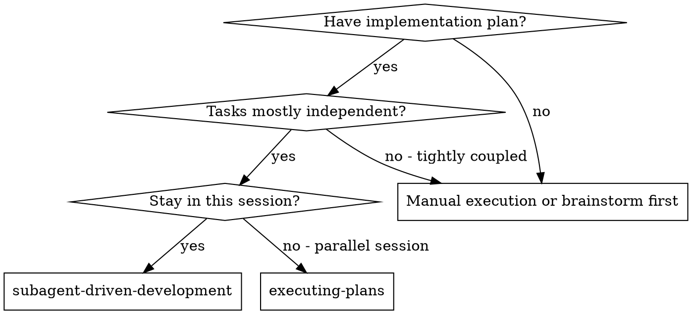
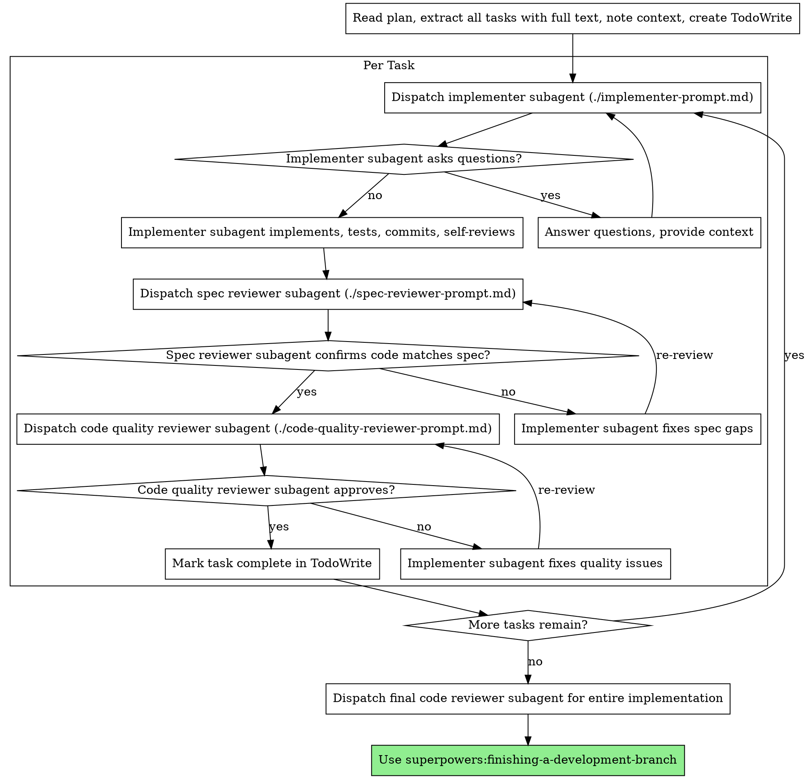

# Subagent-driven development

Execute plans by dispatching a fresh subagent per task, with a two-stage review after each task covering spec compliance first and code quality second.

**Why subagents.** You delegate tasks to specialized agents with isolated context. By precisely crafting their instructions and context, you ensure they stay focused on their assigned scope. They should never inherit your session context or history, because you construct exactly what they need. This also preserves your own context window for orchestration.

**Core principle.** Fresh subagent per task + two-stage review = high quality, fast iteration.

## When to use



Differences from executing-plans in parallel session:
- Same session without context switching
- Fresh subagent per task without context pollution
- Two-stage review after each task with spec compliance first, then code quality
- Faster iteration without manual intervention between tasks

## The process



## Model selection

Use the least powerful model that can handle each role to conserve cost and increase speed.

**Mechanical implementation tasks** with isolated functions and clear specs use a fast, cheap model.

**Integration and judgment tasks** with multi-file coordination or debugging use a standard model.

**Architecture, design, and review tasks** use the most capable available model.

## Handling implementer status

Implementer subagents report one of four statuses:

**DONE.** Proceed directly to spec compliance review.

**DONE_WITH_CONCERNS.** The implementer completed the work but flagged doubts. Read the concerns before proceeding. If concerns involve correctness or scope, address them before review. If they are general observations, note them and proceed to review.

**NEEDS_CONTEXT.** The implementer needs missing information. Provide the required context and re-dispatch.

**BLOCKED.** The implementer cannot complete the task. Assess the blocker:
1. If it is a context problem, provide more context and re-dispatch with the same model.
2. If the task requires deeper reasoning, re-dispatch with a more capable model.
3. If the task is too large, break it into smaller pieces.
4. If the plan itself is flawed, escalate to the human partner.

Never ignore an escalation or force the same model to retry without changes.

## Prompt templates

- `./implementer-prompt.md` dispatches implementer subagent
- `./spec-reviewer-prompt.md` dispatches spec compliance reviewer subagent
- `./code-quality-reviewer-prompt.md` dispatches code quality reviewer subagent

## Example workflow

```
You: I'm using subagent-driven development to execute this plan.

[Read plan file: docs/superpowers/plans/feature-plan.md]
[Extract tasks, create tracking list]

Task 1: Hook installation script
[Dispatch implementation subagent with full task text + context]
Implementer: Implemented install-hook, 5/5 tests passing, committed.

[Dispatch spec compliance reviewer]
Spec reviewer: ✅ Spec compliant, all requirements met.

[Dispatch code quality reviewer]
Code reviewer: Clean architecture, solid tests. Approved.

[Mark Task 1 complete]
...
[After all tasks complete, dispatch final code-reviewer]
Final reviewer: All requirements met, ready to merge.
```

## Red flags

**Never:**
- Start implementation on main or master branch without explicit user consent
- Skip reviews (spec compliance or code quality)
- Proceed with unfixed issues
- Dispatch multiple implementation subagents in parallel to prevent conflicts
- Force subagent to read the plan file directly instead of providing the task text
- Skip context setting needed for the subagent to understand its role
- Accept approximate compliance when spec reviewer flagged defects
- Skip review loops after an implementer attempts a fix
- Let implementer self-review replace external reviewer checks
- Start code quality review before spec compliance is confirmed

**If subagent asks questions:**
- Answer clearly and completely
- Provide additional context before implementation starts

**If reviewer finds issues:**
- Return to implementer subagent to apply targeted fixes
- Re-run reviewer verification until approval is confirmed

## Integration

**Required workflow skills:**
- `using-git-worktrees`, sets up isolated workspace before starting
- `writing-plans`, creates the structured plan this skill executes
- `requesting-code-review`, provides code review template for reviewer subagents
- `finishing-a-development-branch`, completes development after all tasks pass

**Subagents should use:**
- `tdd`, subagents follow test-driven development for each task

**Alternative workflow:**
- `executing-plans`, for executing tasks in the current session without subagent delegation
