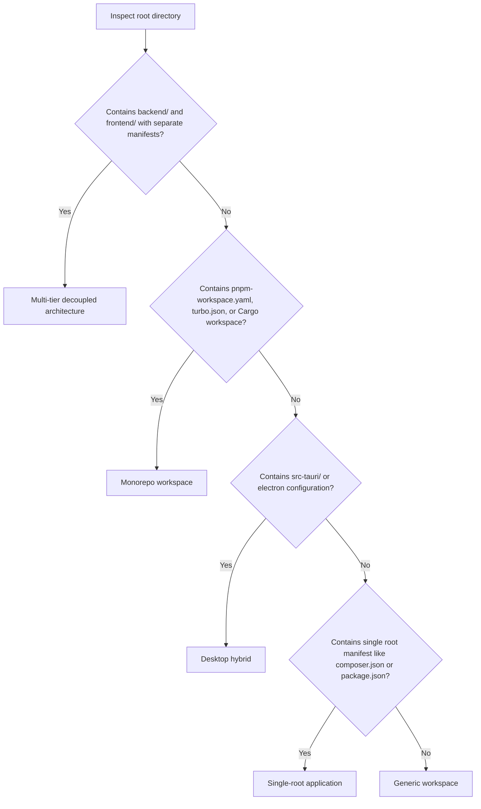

# Workspace topology detection

Guidelines and heuristics for identifying repository structure and selecting documentation targets.

## Repository topologies

Examine directory level 1 and root configuration files to classify the repository into one of four topologies:

### 1. Single-root application
A standalone application where the root directory contains the complete project source code and a single primary package manifest.

#### Manifest indicators
- Root `package.json` without workspace definitions.
- Root `composer.json` without child app directories.
- Root `Cargo.toml` without `[workspace]` members.
- Root `pyproject.toml` or `go.mod`.

#### Documentation target
Generate two files directly in the root directory:
- `/AGENTS.md`
- `/CODEBASE.md`

### 2. Multi-tier decoupled architecture
A project where independent sub-applications live in top-level subdirectories, often deployed separately or maintaining independent Git repositories.

#### Manifest indicators
- Subdirectory `backend/` containing `composer.json`, `pom.xml`, or `Cargo.toml`.
- Subdirectory `frontend/` or `client/` containing `package.json`.
- Root directory contains no app source code, acting only as a workspace container.

#### Documentation target
Generate a hierarchical documentation tree:
- `/AGENTS.md`, root orchestrator defining workspace layout, shared API contracts, and routing between sub-layers.
- `backend/AGENTS.md`, operational rules specific to the backend framework.
- `backend/CODEBASE.md`, architectural reference for backend services, database schema, and routes.
- `frontend/AGENTS.md`, operational rules for frontend components, state management, and styling.
- `frontend/CODEBASE.md`, architectural reference for frontend routing, feature modules, and UI primitives.

### 3. Monorepo workspace
A single repository containing multiple packages or applications managed through a coordinated workspace tooling system.

#### Manifest indicators
- Root `pnpm-workspace.yaml`.
- Root `package.json` containing a `"workspaces"` field.
- Root `turbo.json` (Turborepo), `nx.json` (Nx), or `lerna.json`.
- Root `Cargo.toml` containing a `[workspace]` section with multiple member crates.

#### Documentation target
- `/AGENTS.md`, root orchestrator with shared monorepo scripts (`pnpm build`, `turbo run test`) and cross-package standards.
- `/CODEBASE.md`, top-level dependency graph and package interaction map.
- Individual package instructions inside `packages/<pkg>/AGENTS.md` only if the package contains distinct business invariants.

### 4. Desktop and native hybrid
An application combining a systems runtime with a web or native presentation layer.

#### Manifest indicators
- Directory `src-tauri/` containing `Cargo.toml` alongside a frontend `package.json`.
- Root containing Electron main and renderer bundles.
- Directory `ios/` or `android/` alongside React Native or Flutter manifests.

#### Documentation target
- `/AGENTS.md`, root instructions covering IPC communication security, bridge protocols, and frontend styling bounds.
- `/CODEBASE.md`, architecture map showing IPC commands, native capabilities, and state synchronization.

## Topology classification decision tree

