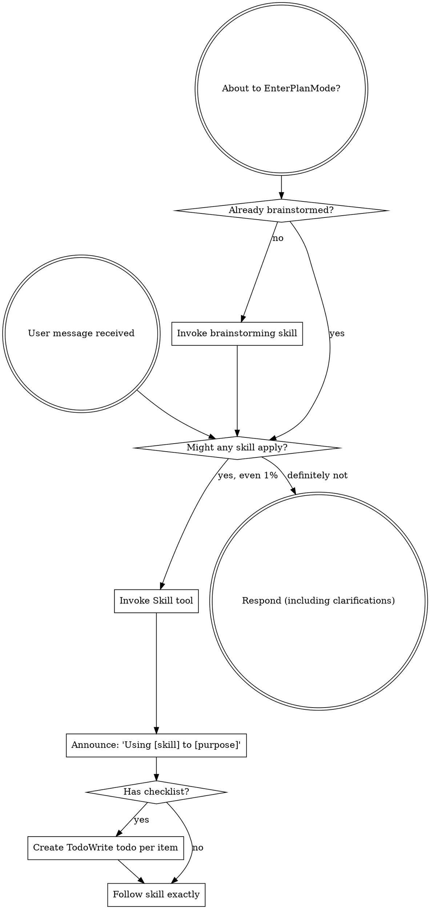

<SUBAGENT-STOP>
If you were dispatched as a subagent to execute a specific task, skip this skill.
</SUBAGENT-STOP>

<EXTREMELY-IMPORTANT>
If you think there is even a 1% chance a skill might apply to what you are doing, you ABSOLUTELY MUST invoke the skill.

IF A SKILL APPLIES TO YOUR TASK, YOU DO NOT HAVE A CHOICE. YOU MUST USE IT.

This is not negotiable. This is not optional. You cannot rationalize your way out of this.
</EXTREMELY-IMPORTANT>

## Instruction priority

Superpowers skills override default system prompt behavior, but user instructions always take precedence:

1. **User explicit instructions** (CLAUDE.md, GEMINI.md, AGENTS.md, direct requests), highest priority
2. **Superpowers skills**, which override default system behavior where they conflict
3. **Default system prompt**, lowest priority

If CLAUDE.md, GEMINI.md, or AGENTS.md says "don't use TDD" and a skill says "always use TDD," follow the user instructions. The user is in control.

## How to access skills

**In Claude Code.** Use the `Skill` tool. When you invoke a skill, its content is loaded and presented to you, so follow it directly. Never use the Read tool on skill files.

**In Copilot CLI.** Use the `skill` tool. Skills are auto-discovered from installed plugins. The `skill` tool works the same as Claude Code's `Skill` tool.

**In Gemini CLI.** Skills activate via the `activate_skill` tool. Gemini loads skill metadata at session start and activates the full content on demand.

**In other environments.** Check your platform documentation for how skills are loaded.

## Platform adaptation

Skills use Claude Code tool names. For non-CC platforms, see `references/copilot-tools.md` (Copilot CLI) and `references/codex-tools.md` (Codex) for tool equivalents. Gemini CLI users get the tool mapping loaded automatically via GEMINI.md.

# Using skills

## The rule

**Invoke relevant or requested skills BEFORE any response or action.** Even a 1% chance a skill might apply means that you should invoke the skill to check. If an invoked skill turns out to be wrong for the situation, you don't need to use it.

## Red flags

These thoughts indicate rationalization, so stop immediately:

| Thought | Reality |
|---|---|
| "This is just a simple question" | Questions are tasks. Check for skills. |
| "I need more context first" | Skill check comes BEFORE clarifying questions. |
| "Let me explore the codebase first" | Skills tell you HOW to explore. Check first. |
| "I can check git/files quickly" | Files lack conversation context. Check for skills. |
| "Let me gather information first" | Skills tell you HOW to gather information. |
| "This doesn't need a formal skill" | If a skill exists, use it. |
| "I remember this skill" | Skills evolve. Read current version. |
| "This doesn't count as a task" | Action = task. Check for skills. |
| "The skill is overkill" | Simple things become complex. Use it. |
| "I'll just do this one thing first" | Check BEFORE doing anything. |
| "This feels productive" | Undisciplined action wastes time. Skills prevent this. |
| "I know what that means" | Knowing the concept ≠ using the skill. Invoke it. |

## Skill priority

When multiple skills could apply, use this order:

1. **Process skills first** (brainstorming, debugging), which determine how to approach the task.
2. **Implementation skills second** (frontend-design, mcp-builder), which guide execution.

"Let's build X" leads to brainstorming first, then implementation skills.
"Fix this bug" leads to debugging first, then domain-specific skills.

## Skill types

**Rigid skills** (TDD, debugging) must be followed exactly without adapting away discipline.

**Flexible skills** (patterns) adapt principles to context.

The skill itself tells you which.

## User instructions

Instructions say WHAT, not HOW. "Add X" or "Fix Y" doesn't mean skip workflows.
