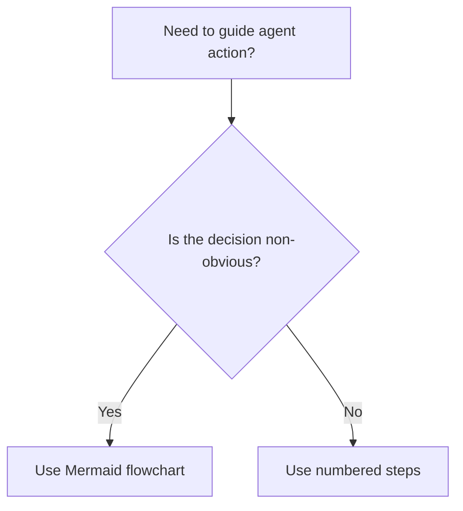

# Writing skills

Write deterministic, test-driven skills and process documentation for AI agents.

## Overview

Writing skills applies test-driven development to process documentation. An untested skill is an unverified hypothesis. Before deploying a skill, run baseline scenarios with a subagent, record unguided behavior, draft instructions that address observed failures, and close procedural loopholes.

Read `references/google-agent-standards.md` for authoritative guidance from Google Cloud Dialogflow CX, Vertex AI, Gemini API, Antigravity, and the Google Developer Style Guide.

## Workflow

Follow these four steps in sequence:

### Step 1. Baseline failure scan (RED)

Run a representative task with a subagent without the candidate skill loaded.

- Present a realistic coding or operational task.
- Observe whether the agent takes shortcuts, skips intermediate tests, or misinterprets tool conventions.
- Record the exact failure modes and rationalizations produced by the model.

Completion criterion. A written record identifying unguided failure modes and exact model rationalizations.

### Step 2. Minimal skill drafting (GREEN)

Write the skill to address the observed failure patterns directly.

- Define explicit boundaries, sequencing, and positive actions.
- Keep instructions operational and concrete. Name exact file paths, shell commands, and preconditions.
- Pair negative constraints with immediate positive actions.
- Avoid overt manipulation, emotional appeals, and artificial stress. Modern foundation models degrade under artificial pressure.
- For deep testing patterns, see `references/testing-methodology.md`.

Completion criterion. A complete draft of `SKILL.md` addressing every observed baseline failure mode.

### Step 3. Loophole closure and refactoring (REFACTOR)

Dispatch a fresh subagent with the candidate skill active.

- Verify that the subagent complies with the required steps under identical task conditions.
- If the agent rationalizes a shortcut around a rule, add an explicit counter to the instruction.
- Re-run the scenario until the agent follows the procedure without evasion.

Completion criterion. The subagent completes the task following all instructions across two consecutive runs.

### Step 4. Unslop and style verification pass

Run the completed skill draft through the quality checklist:

- Replace em dashes and en dashes with periods or commas.
- Restrict colons to introducing lists, tables, or code blocks.
- Strip promotional adjectives, vague metaphors, and conversational padding.
- Confirm all headings use sentence case without decorative emojis.
- Verify that every step terminates on a checkable binary completion criterion.

Completion criterion. The skill satisfies all criteria in the quality checklist with zero violations.

## Directory structure

Organize skills within standard workspace or global customization roots:

```text
skills/<skill-name>/
├── SKILL.md              # Required: main entrypoint and runbook
├── references/           # Optional: deep reference manuals and guides
├── scripts/              # Optional: deterministic executable helpers
└── examples/             # Optional: verified sample implementations
```

Discovery locations in order of priority:
1. Workspace project customizations: `.agents/skills/`
2. Global machine configuration: `~/.gemini/config/skills/`
3. Built-in application mounts

## SKILL.md structure and frontmatter

Every skill entrypoint must contain YAML frontmatter and standard sections:

```yaml
---
name: skill-name-in-kebab-case
description: Use when [specific triggering conditions and symptoms].
---
```

Frontmatter rules:
- `name`: Use lowercase letters, digits, and hyphens only.
- `description`: Write in third person, starting with "Use when...". Describe triggering symptoms and operational conditions only. Never summarize the workflow in the description, because models may execute the summary instead of reading the complete skill body. Keep descriptions under 500 characters.

## Progressive disclosure and information hierarchy

Divide skill content into three tiers:
1. Primary tier. In-file execution steps in `SKILL.md`. Keep this document concise, ideally under 250 lines.
2. Secondary tier. In-file rules and lookup tables consulted on demand.
3. Tertiary tier. Separate files in `references/` or `scripts/`, reached by context pointers and loaded only when needed.

Move heavy documentation (exceeding 100 lines) out of `SKILL.md` into `references/` to preserve context window tokens.

## Decision flowcharts

Use Mermaid flowcharts only for non-obvious branching decisions. For linear procedures, use numbered steps.



## Quick reference checklist

Run this check before publishing a skill:

| Check | Passing condition |
|---|---|
| Frontmatter | Contains kebab-case name and trigger-only description starting with "Use when" |
| Context load | `SKILL.md` is under 250 lines with heavy reference moved to `references/` |
| Style | Zero em dashes, zero decorative emojis, and sentence case headings |
| Verification | Baseline failure observed without skill; compliance confirmed with skill active |
| Completion criteria | Every step defines a binary, checkable completion criterion |
